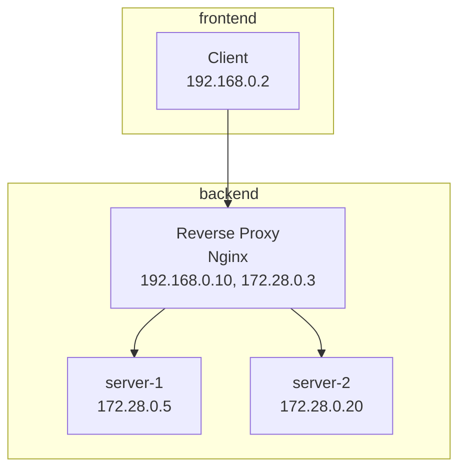

# nginx-reverse-proxy

リバースプロキシの勉強に使ったリポジトリです




## 使い方

以下のコマンドでコンテナをビルド、起動します

`docker compose up --build -d`

次に`client`コンテナに入ります

`docker exec -it <client-container-id> sh`

※ client コンテナをわざわざ使っている理由は、server-1.local などのホスト名を使用するためにホスト側で設定をする必要があり、ローカル環境を汚したくないからです。

コンテナ内で以下のコマンドを実行して、プロキシが正しく動作していることを確認します
```bash
curl http://server-1.local
curl http://server-2.local
```
それぞれ異なるレスポンス(文字列)が返ってくれば、リバースプロキシとして正常に振り分けできていることが確認できます。

`/etc/hosts`を見ると、ホスト`server-1.local`、`server-2.local`に同じipが割り当てられていることがわかります。
そのため、実際には同じ Nginx リバースプロキシにアクセスしており、プロキシ側でホスト名をみて`server-1`と`server-2`へルーティングされていることが確認できます。
